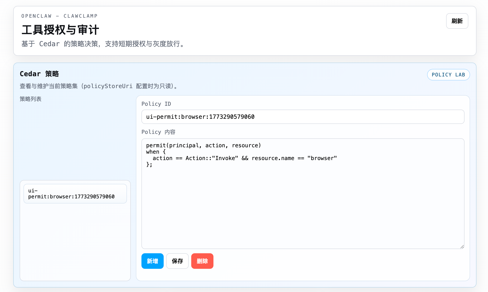
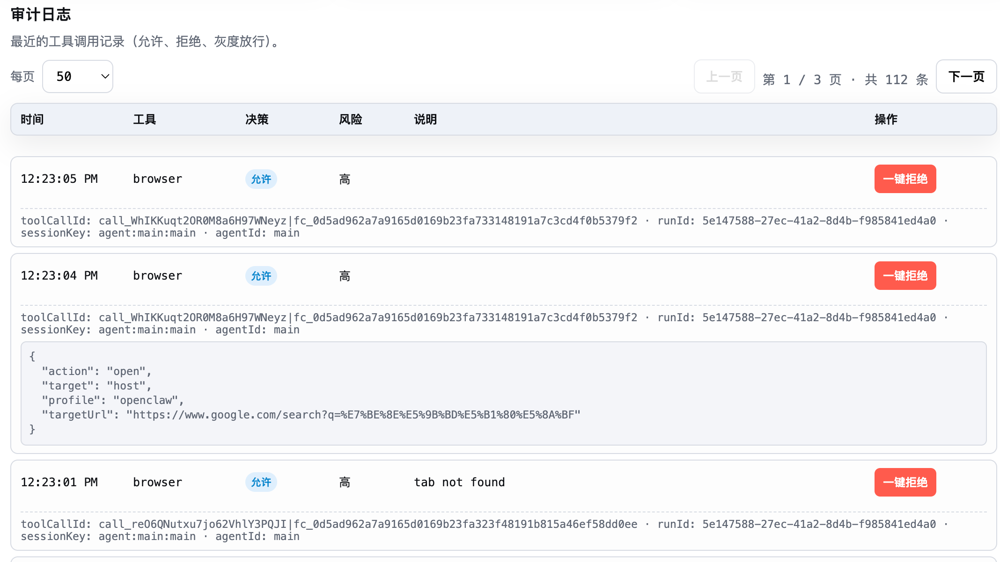
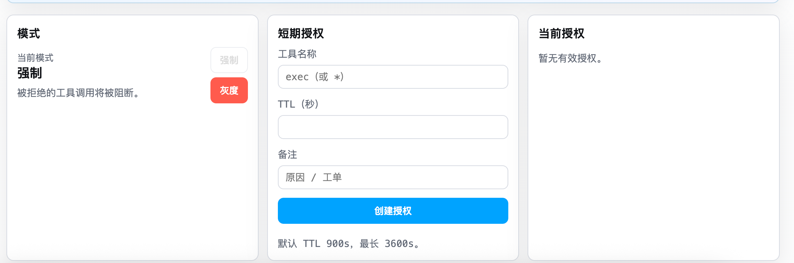

# Clawclamp

[中文说明](./README.zh-CN.md)


Clawclamp adds Cedar-based authorization to OpenClaw tool calls. It evaluates every tool invocation via a Cedar policy, records allow/deny decisions to an audit log, and exposes a gateway UI for reviewing logs and granting short-term approvals.

This repository is a vibe-coding project and most of the implementation was generated with AI assistance.

By default, Clawclamp starts in `gray` mode so a fresh installation does not block all tools immediately. Teams can observe policy effects first and then switch to `enforce`.

## UI Preview

Clawclamp ships with a compact web UI focused on three things: policy authoring, audit review, and runtime mode / temporary grant operations.

- `Policy Lab`: create, edit, delete, and inspect Cedar policies from the browser
- `Audit Log`: review allowed, denied, and gray-mode calls with request details
- `Mode And Grants`: switch between `gray` and `enforce`, and issue short-term approvals

## Screenshots

### Policy Lab



### Audit Log



### Mode And Grants



## Features

- Cedar policy enforcement for `before_tool_call`.
- Long-term authorization via Cedar policy.
- Short-term authorization via time-bound Cedar policy.
- Audit UI for allowed/denied/gray-mode tool calls.
- Gray mode: denied calls are still executed but logged as overrides.

## Install

From npm:

```bash
openclaw plugins install @plusplus7/clawclamp
```

Or in config / plugin management, use the package name `@plusplus7/clawclamp`.

## GitHub

Recommended repository description:

> Cedar-based authorization and audit plugin for OpenClaw, built as a vibe-coding / AI-assisted project.

Suggested topics:

`openclaw`, `cedar`, `authorization`, `audit`, `plugin`, `ai-generated`, `vibe-coding`

## Configuration

Configure under `plugins.entries.clawclamp.config`:

```yaml
plugins:
  entries:
    clawclamp:
      enabled: true
      config:
        mode: gray
        principalId: openclaw
        policyStoreUri: file:///path/to/policy-store.json
        policyFailOpen: false
        # 可选：UI 访问令牌（非 loopback 时可通过 ?token= 或 X-OpenClaw-Token 访问）
        # uiToken: "your-ui-token"
        risk:
          default: high
          overrides:
            read: low
            web_search: medium
            exec: high
        grants:
          defaultTtlSeconds: 900
          maxTtlSeconds: 3600
        audit:
          maxEntries: 500
          includeParams: true
```

`policyStoreUri` points to a Cedar policy store JSON (file:// or https://). `policyStoreLocal` can be set to a raw JSON string for the policy store. If omitted, the plugin uses a built-in policy store that denies all tool calls unless a grant is active or an explicit permit policy exists. The default plugin mode is `gray`, not `enforce`.

## UI

Open the gateway path `/plugins/clawclamp` to view audit logs, toggle gray mode, and create short-term grants.

UI access rules:

- Loopback (127.0.0.1 / ::1) is allowed without a token.
- Non-loopback requires a token via `?token=` or `X-OpenClaw-Token` / `Authorization: Bearer`.

Policy management:

- The UI includes a Cedar policy panel for CRUD.
- If `policyStoreUri` is set, policies are read-only.
- Default policy set is empty, so all tool calls are denied unless you add permit policies.
