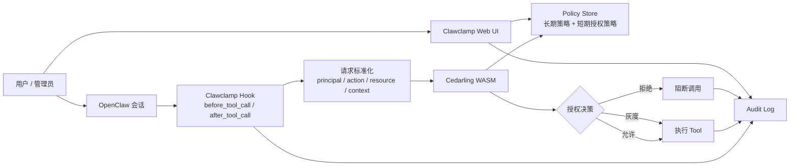

# Clawclamp 技术白皮书

## 摘要

随着 AI Agent 从对话型助手逐步演进为可调用浏览器、执行命令、读写文件、访问网络与操作外部系统的执行体，权限控制问题开始从“模型安全”走向“系统级安全”。在这一趋势下，OpenClaw 这类高能力 Agent 框架既带来了强大的自动化能力，也带来了显著的操作风险。

Clawclamp 是一个面向 OpenClaw 的 Cedar 授权与审计插件。它的核心目标不是削弱 Agent 的能力，而是为 Agent 的能力建立一层结构化、可审计、可灰度、可治理的权限边界。Clawclamp 通过 Cedar policy 对每一次工具调用进行前置决策，并将策略治理、短期授权、审计追踪与可视化管理整合在同一个插件中。

本文将从项目背景、系统设计、实现原理、Cedar 的技术优势，以及未来在 ToB 场景中的应用前景几个方面，对 Clawclamp 进行系统介绍。

## 一、项目背景

### 1.1 Agent 能力正在快速外溢

新一代 Agent 系统不再局限于“给建议”或“生成文本”，而是开始接入浏览器、终端、文件系统、外部 API 以及企业内部服务，真正具备“执行动作”的能力。对个人用户来说，这意味着效率提升；对企业系统来说，这意味着一个原本只负责理解和生成的模型，正在逐步获得访问环境、修改状态、触发副作用的能力。

这类变化直接改变了风险边界。过去一个回答出错，更多只是信息误导；现在一次工具调用出错，可能就会演化为敏感数据泄露、高危命令误执行、生产资源误操作，甚至绕过现有合规链路。也就是说，Agent 风险正在从内容层问题，迁移为运行时控制问题。

### 1.2 传统权限方案难以直接迁移到 Agent

传统系统中的权限管理通常建立在“用户 -> 资源 -> 动作”的静态模型上，但 Agent 系统里的授权判断发生得更频繁，也更依赖上下文。一次工具调用是否应该被允许，往往不仅取决于工具本身，还取决于风险等级、当前时间、会话场景、是否处于灰度期、是否存在临时授权等动态因素。

因此，Agent 权限控制不能只靠一组硬编码的 `if/else`，也不能只靠简单的 allowlist。它需要一种声明式、可解释、可扩展的授权模型，并且这套模型必须能和实际运行时深度结合。

### 1.3 为什么是 Clawclamp

Clawclamp 的出发点非常直接：

> 给高能力 Agent 加一个“权限夹具”。

这个“夹具”必须真正落在运行链路里，而不是只停留在概念上。它需要嵌入 OpenClaw 的工具调用生命周期，对每次调用做前置授权；也需要同时支持长期策略治理和短期临时放行；更重要的是，它不能成为一个黑盒，必须让允许、拒绝、灰度放行都被记录、被看见、被人工干预。

因此，Clawclamp 采用插件形式集成到 OpenClaw，并选择 Cedar 作为权限策略语言与授权引擎。前者解决接入问题，后者解决表达和执行问题。

## 二、为什么选择 Cedar

### 2.1 Cedar 是什么

Cedar 是一门面向授权场景的声明式策略语言，可以用来表达“谁在什么条件下可以对什么资源执行什么动作”。对 Clawclamp 来说，Cedar 的价值不在于它有多复杂，而在于它非常适合把权限判断从业务代码里抽离出来，让权限逻辑本身成为一个可独立演进的治理层。

一个典型的 Cedar policy 很像下面这样：

```cedar
permit(principal, action, resource)
when {
  action == Action::"Invoke" &&
  resource.name == "browser"
};
```

这种表达方式足够简单，也足够稳定。对 Agent 系统来说，这一点很重要，因为权限规则最终一定会不断变化：一开始可能只是拦几个高危工具，后来会演进到风险分级、审批联动、租户隔离和例外处理。如果一开始就把这些逻辑写死在代码里，后续维护成本会很快失控。

### 2.2 Cedar 的核心优势

相较于硬编码权限、数据库角色表或简单规则引擎，Cedar 更适合 Agent 场景的原因其实很朴素。第一，它是声明式的，规则本身清晰可读，适合审查和迭代；第二，它天然支持上下文判断，像 `context.now`、`resource.name`、`context.risk` 这类运行时信息都能直接参与授权；第三，它同时支持 `permit` 和 `forbid`，既能表达常规放行，也能表达强约束红线。

对 Clawclamp 来说，真正关键的不是“用了 Cedar”这件事本身，而是 Cedar 让长期授权、短期授权、人工一键生成策略、灰度观察这些能力都能收敛到一套统一语义里。这样系统不会随着功能增加而堆出多套判断链路，后续要做 ToB 场景扩展时也更稳。

## 三、Clawclamp 的系统设计

### 3.1 总体架构

Clawclamp 以 OpenClaw plugin 的形式接入，但它不是简单地在工具调用前面套一个开关，而是把授权、策略、短期授权和审计串成一条完整的数据链路。下面这张图可以更直观地说明它的结构。



从架构上看，Clawclamp 可以分成四层。最外层是 Hook 拦截层，负责嵌入 OpenClaw 的工具生命周期；往里一层是 Cedar 授权层，把一次工具调用转换成标准的 Cedar request；再往里是 Policy / Grant 管理层，负责把长期策略和短期授权统一存进 policy store；最上层则是审计与 UI 层，让策略和历史调用都能被人看见、理解和操作。

### 3.2 授权时机

每次 OpenClaw 即将调用工具时，Clawclamp 都会收到一个 `before_tool_call` 事件。插件会把这次调用重写成一个标准授权请求：谁在调用、调用的是哪个动作、目标工具是什么、当前上下文包含什么信息。随后，这个请求会被送入 Cedarling 做同步决策。

在执行层面，Clawclamp 并不只有简单的允许或拒绝两种状态。它还引入了灰度模式：如果系统处于强制模式，`deny` 会直接阻断工具调用；如果系统处于灰度模式，同样的 `deny` 会被放行执行，但会被明确记录成一次“本应拒绝但被灰度放过”的调用。这让策略治理可以先观察、后收紧，而不是一上来就把所有流量都卡死。

### 3.3 长期授权与短期授权统一进 Cedar

Clawclamp 的一个关键设计是：

> 不把“短期授权”当成 Cedar 之外的特例，而是把它也建模成 Cedar policy。

因此：

- 长期授权由常规 permit/forbid policy 表达
- 短期授权由带过期时间条件的 permit policy 表达

例如临时允许某个工具 15 分钟：

```cedar
permit(principal, action, resource)
when {
  action == Action::"Invoke" &&
  context.now < 1773290000000 &&
  resource.name == "exec"
};
```

这样做的直接好处是，系统不会出现“两套授权体系并存”的问题。长期规则和短期例外都被放进同一个 Cedar policy store 里，审计日志看到的也是统一的策略命中结果。未来如果要接审批系统、工单系统或者自动回收机制，也只需要围绕 policy 的增删改展开，而不需要再额外维护一套临时授权子系统。

### 3.4 审计优先

Clawclamp 的审计不是附属能力，而是核心能力之一。它不仅记录“调用了什么工具”，也记录请求时间、风险等级、最终决策、Cedar 原始决策、工具参数摘要、会话关联信息以及执行结果。对外看，这是一份操作历史；对平台侧看，它其实是一层运行时可观测性。后续无论是做风控分析、异常检测，还是把审批流和执行流打通，都需要以这样的审计数据为基础。

## 四、实现原理

### 4.1 OpenClaw Hook 集成

Clawclamp 通过 OpenClaw 插件机制注册两个关键 hook：

- `before_tool_call`
- `after_tool_call`

在 `before_tool_call` 中，插件会构建 Cedar request、执行授权、根据当前模式决定阻断还是放行，并在决策前后都写入日志。在 `after_tool_call` 中，插件再补充执行结果、耗时、错误信息等内容。这样做的目的，是把“授权决策”与“实际执行结果”都放进同一条审计链路里，避免只看见前者却看不见后者。

### 4.2 Cedarling WASM

Clawclamp 使用 Cedarling WASM 作为嵌入式授权引擎。这个选择比较务实：一方面，它适合插件化集成，不需要额外部署独立授权服务；另一方面，它的调用开销也比较低，适合放在每次工具调用前做实时判断。系统会在策略更新或 policy store 内容变化时刷新 Cedarling 实例，确保新的 policy 能及时生效。

### 4.3 Policy Store

Clawclamp 使用 Cedar policy store JSON 存储全部授权策略，包括：

- 长期 permit policy
- 长期 forbid policy
- 短期 grant policy

策略的来源可以是 UI 手工新增，也可以来自审计日志中的“一键允许”“一键拒绝”，或者来自短期授权创建。无论入口是什么，最终都会收敛为同一份 policy store。这一点很关键，因为它让策略治理真正形成闭环：观察到一个调用，再把它沉淀成策略，然后由同一个引擎持续执行。

### 4.4 灰度模式

灰度模式是 Clawclamp 中一个非常实用的设计。它允许团队在正式启用强制阻断前，先观察策略效果：即便 Cedar 判断为拒绝，只要当前模式是灰度，工具调用仍然可以继续执行，但审计日志会明确标记这是一条灰度放行记录。对企业接入来说，这会显著降低初始上线成本，因为团队可以先“看见问题”，再逐步“收紧权限”。

### 4.5 一键策略化

在审计日志中，管理员可以直接对某个调用执行一键允许或一键拒绝，系统会立刻为该工具生成对应的 Cedar policy。这个设计把“看日志”和“改策略”两件事打通了。也就是说，运营者不需要再从问题现场跳转到另一个策略后台重写规则，而是可以沿着一次具体调用直接完成治理动作，这大幅降低了策略迭代的门槛。

## 五、Clawclamp 的技术价值

### 5.1 从 Prompt Safety 走向 Runtime Authorization

很多 Agent 系统目前仍然主要依赖：

- 系统提示词约束
- 安全对齐
- 输出过滤

这些能力重要，但它们不等于权限控制。Clawclamp 的价值在于把控制点下沉到 runtime：

- 真正进入工具执行前做授权
- 用外部策略而非模型自觉来约束能力
- 让权限边界不依赖模型“是否听话”

### 5.2 从“能不能做”走向“谁在什么条件下能做”

Clawclamp 引入的是结构化授权，而不是简单的工具开关。它让未来的控制模型可以逐步扩展为：

- 哪个用户能调用哪个工具
- 哪类风险动作需要审批
- 哪些环境只允许灰度
- 哪些客户只开放白名单工具
- 哪些租户有不同的审计保留规则

### 5.3 让 Agent 治理具备平台基础设施属性

一个成熟的企业级 Agent 系统，不会只关心模型能力，还必须具备：

- 权限治理
- 审计合规
- 人工干预
- 分级放权
- 可视化管理

Clawclamp 的意义在于，它把这些能力开始沉淀成一套基础设施。

## 六、ToB 场景的未来展望

### 6.1 企业内部 Agent 平台

未来企业内部的 Agent 很可能不是单一机器人，而是一组有不同职责的执行体：

- 研发 Agent
- 运维 Agent
- 客服 Agent
- 财务 Agent
- 办公自动化 Agent

这些 Agent 的权限天然不同。Clawclamp 这类能力可以成为企业 Agent 平台中的授权中枢。

### 6.2 工单和审批联动

短期授权天然适合与审批系统打通。例如：

- 安全人员审批后放行某个高危工具 30 分钟
- 工单关闭后自动撤销 grant
- 审批记录与审计日志自动关联

这种模式在运维、研发效能、SRE、自助排障等场景中非常有价值。

### 6.3 多租户与环境隔离

ToB 场景中最常见的需求之一，是：

- 不同客户租户策略不同
- 测试环境和生产环境策略不同
- 不同团队有不同治理规则

基于 Cedar 的策略体系天然适合继续往多租户 policy segmentation 演进。

### 6.4 与数据安全和合规系统联动

未来 Agent 权限不应只是“是否允许调用工具”，还可以进一步与：

- 数据分级分类
- DLP
- SIEM / SOC
- 身份认证系统
- 组织架构权限系统

联动起来。届时，Clawclamp 可以从一个插件逐步演进为企业 Agent Control Plane 的一部分。

### 6.5 从工具级授权走向任务级授权

今天 Clawclamp 关注的是单次工具调用授权。未来更进一步，可以扩展到任务级别：

- 某类任务允许哪些工具组合
- 某类任务允许持续多久
- 某类任务需要几级审批
- 某类任务的审计等级和留存要求

这将使 Agent 授权从“单动作控制”进一步升级到“业务流程控制”。

## 七、结语

AI Agent 的能力越强，权限控制就越不能停留在提示词和经验规则层面。真正可落地的企业级 Agent，需要的是一套能够在运行时生效、可声明、可审计、可治理、可演进的授权机制。

Clawclamp 的价值不在于“限制 Agent”，而在于让 Agent 的能力能够被安全地释放出来。通过 Cedar，Clawclamp 把长期规则、短期授权、灰度观察和审计追踪统一到了同一套授权框架之中，这为未来企业级 Agent 平台的权限治理提供了一个清晰的技术方向。

从这个角度看，Clawclamp 不只是一个 OpenClaw 插件，更像是面向 Agent 时代的一块权限基础设施试验田。
